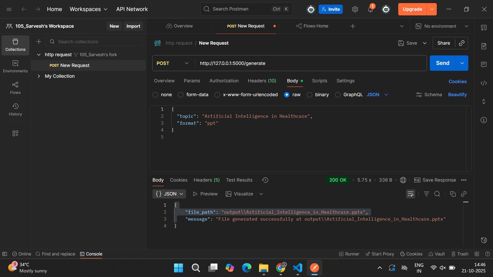
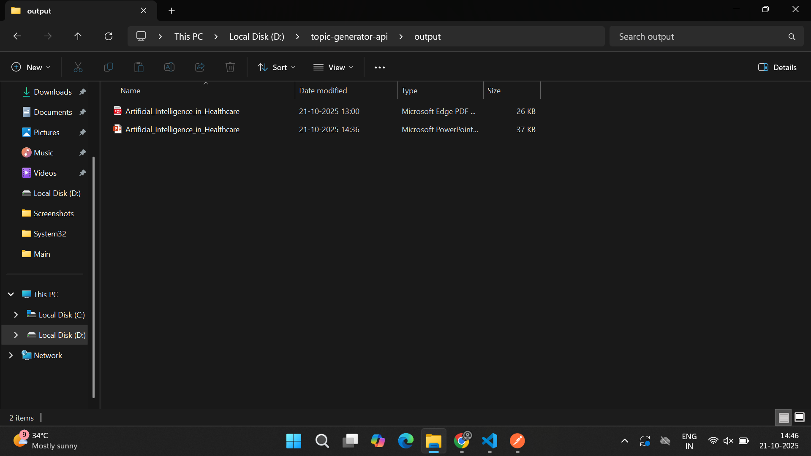

# 🧠 Topic Research Generator API

A **Flask-based API** that uses **Google Gemini** to generate research content for any topic and exports it as **PDF** or **PPT**.

---

## 🚀 Features

- Generate structured research content on any topic.
- Export content as **PDF** or **PowerPoint**.
- Supports bullet points, sections/slides, and image suggestions.
- Easily configurable via `.env` file for API key.

---

## 📦 Project Structure

D:\topic-generator-api
├── app.py
├── requirements.txt
├── README.md
├── output/ # Generated PDF/PPT files
├── utils/
│ ├── gemini_client.py
│ ├── pdf_generator.py
│ ├── ppt_generator.py
│ └── fonts/ # Custom fonts (Helvetica)
├── Images/
│ ├── Created_Files.png # Example generated PDF/PPT
│ └── Postman_Testing.png # Postman API test screenshot
└── .env # Gemini API Key (ignored in Git)

---

## ⚡ Getting Started

### 1. Clone the repository

git clone https://github.com/sarveshdabke/Topic-Generator-API.git
cd Topic-Generator-API

### 2. Create .env file

Create a .env file in the root directory and add your Gemini API key:

GEMINI_API_KEY=your_new_api_key_here

Important: .env is included in .gitignore for security.

### 3. Install dependencies
pip install -r requirements.txt

### 4. Run the Flask API
python app.py

### 📡 Testing the API (Postman)

Open Postman.

Make a POST request to:
http://127.0.0.1:5000/generate

JSON Body example:
{
    "topic": "Artificial Intelligence in Healthcare",
    "format": "pdf"
}

Response will contain download link for generated PDF or PPT.

### Postman Testing Screenshot

### Example Output

---

## 👤 Developer Info
**Developer:** Sarvesh Dabke  
**Email:** dabkesarvesh7@gmail.com  

**GitHub:** [github.com/sarveshdabke](https://github.com/sarveshdabke)  

---

## 🪪 License
This project is licensed under the MIT License — you are free to use and modify it with proper credit.

---

## ⭐ Support
If you like this project, give it a star on GitHub!  
[Star Topic-Generator-API](https://github.com/sarveshdabke/Topic-Generator-API)
